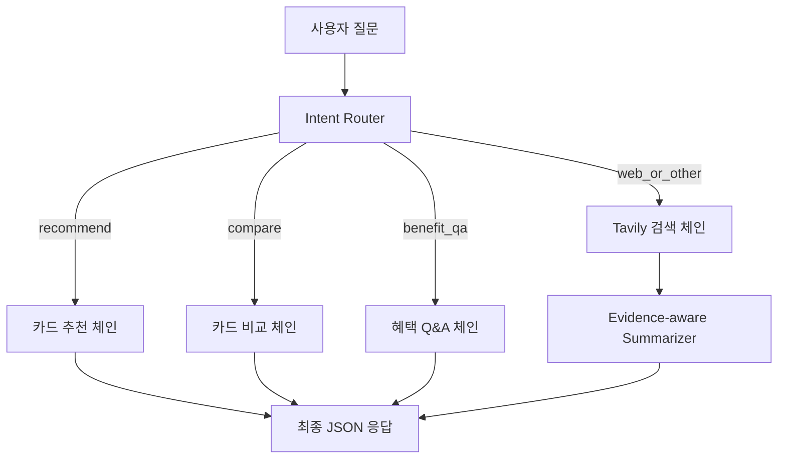

# 💳 Card Chatbot — **LangChain · RAG · Prompt Engineering 중심**

**“카드 혜택을 RAG로 검색하고, 프롬프트로 의사결정을 구조화한다.”**  
이 프로젝트의 핵심은 **LangChain 오케스트레이션 + RAG 파이프라인 + Prompt Engineering**입니다.  
UI는 *데모/검증용* Streamlit이며, **모델·검색·추론 계층**이 진짜 가치입니다.

<p align="left">
  
  
  
  
</p>

---

## 🧭 Executive Summary (for Stakeholders)
- **Problem**: 혜택 정보가 복잡·분절되어 사용자가 “내 상황”에 맞는 카드를 고르기 어렵다.  
- **Solution**: 로컬 JSON → **임베딩 검색(FAISS)** + (옵션) **리랭크** + **근거 중심 요약**으로 **맥락형 Top‑N 추천**.  
- **Differentiators**
  - ⚡ **로컬‑우선(RAG first)**: 외부 의존 최소 → 낮은 비용/짧은 응답/쉬운 이식
  - 🔎 **Explainability**: 매칭 키워드·근거 문장 노출 → 신뢰성/디버깅 용이
  - 🧱 **모듈형**: 크롤링·룰 엔진·LLM 교체·배치 갱신 등 단계적 확장 용이

---

## ✨ Core Features
- **자연어 + 키워드 혼합 질의** → **표준 키워드 정규화** → 의미 기반 검색
- **Retriever → (옵션) Re‑rank → LLM 요약**: 근거 포함 결과 생성
- **Conversation Memory**: `ConversationBufferMemory`로 최근 맥락 유지
- **Tavily(옵션)**: 최신 외부 사실 보강(필요 시만 on, 실패시 **graceful degrade**)

---

# 🧱 Prompt Engineering for Credit Card Assistant

본 문서는 **신용카드 혜택 추천·비교·검색 어시스턴트**의 프롬프트 엔지니어링 구조를 설명합니다.  
모델은 **카드 혜택 전문가**로 동작하며, 모든 응답은 **한국어 + JSON 형식**만 출력합니다.

---

## 시스템/출력 포맷 (역할 고정)

모델은 항상 **신용카드 혜택 전문가**로 동작하며, 아래 **일관된 JSON 스키마**를 출력합니다.

```text
{
  "intent": "recommend" | "compare" | "benefit_qa" | "web_or_other",
  "reasons": ["추천/판단 근거 1","추천/판단 근거 2"],
  "suggestions": ["다음 행동 제안 1","다음 행동 제안 2"],
  "evidence_keywords": ["교통","편의점"],
  "evidence_snippets": ["근거 문장 1","근거 문장 2"]
}
```

### 규칙
- 반드시 **JSON만 출력** (설명/불필요한 텍스트 금지)
- 컨텍스트에 존재하는 카드/혜택만 사용
- 정보 부족 시 결론 유보 + `suggestions`에 **추가 질문 1개** 포함

---

## Intent Router (질의 유형 분류)

사용자 질문을 아래 4개 intent 중 하나로 분류합니다.

- **recommend**: 사용자의 소비 패턴/선호에 맞춘 카드 추천  
- **compare**: 특정 카드 간 조건·혜택 비교  
- **benefit_qa**: 정보 부족시 역질문
- **web_or_other**: 카드 무관 질문 웹 검색

### 규칙
- 카드 혜택 관련이면 가급적 `"web_or_other"`은 피한다.  
- `benefit_qa`는 **역 질문**  
- intent별 few-shot 예시를 내부적으로 학습시켜 경계 사례 혼동 최소화  

출력 예시:
```json
{"intent":"recommend"}
```

---

## Evidence-aware Summarizer (근거 중심 요약)

검색 컨텍스트에서 **증거 문장**을 추출해 요약합니다.

- 2~3개의 불릿으로 핵심 혜택 요약  
- 매칭된 키워드는 `evidence_keywords`에 배열로 저장  
- 짧은 근거 문장은 `evidence_snippets`에 기록 (≥1개)  
- {context} 부족 시 → 결론 유보 + `suggestions`에 필요한 질문 포함  

출력은 반드시 위 (1)의 JSON 스키마 형식 준수.

---

## Tavily 호출 규칙 (외부·비정형 질의)

**트리거:** Intent Router 결과가 `"web_or_other"`인 경우  

### 실행 단계
1. 질문을 웹 검색 쿼리로 정제 (enhance_query)  
2. Tavily(`max_results=2~5`) 호출 → 의미 있는 결과만 선별  
3. 검색 요약을 `{context}`에 병합 후 Summarizer 전달  
4. 요약 시 출처·도메인 언급 (예: "네이버 뉴스", "금융감독원")  

---

## 플로우차트 (Mermaid)



---

## 🧩 LangChain Orchestration

### 체인 구성
- **Embedding → FAISS**: `혜택 설명` 단락 임베딩 후 로컬 인덱스
- **Retriever**: 유사도 Top‑K 문서 반환
- **(옵션) Re‑rank**: CrossEncoder로 상위 후보 재정렬
- **LLM Summarizer**: 근거 포함 요약/추천 사유 생성
- **Memory**: `ConversationBufferMemory`로 **히스토리(k=4)** 유지

### 코드 스케치 (요지)
```python
from langchain_community.vectorstores import FAISS
from langchain_huggingface import HuggingFaceEmbeddings
from langchain.memory import ConversationBufferMemory
from sentence_transformers import CrossEncoder

emb = HuggingFaceEmbeddings(model_name="jhgan/ko-sroberta-multitask")
vs = FAISS.from_texts(texts, emb)
retriever = vs.as_retriever(search_kwargs={"k": 12})

memory = ConversationBufferMemory(k=4, return_messages=True)
# USE_RERANKER=true 일 때 CrossEncoder로 상위 후보 재정렬 → 상위 N만 컨텍스트
```

### History(대화 히스토리) 규칙
- 최근 **k=4 turns**만 유지(토큰 초과 방지), 필요 시 요약 압축
- 히스토리는 **선호/맥락 유지**에 사용, **사실 근거는 Retrieval 결과**에서만

---

## 🏗 Architecture (RAG‑first)
```text
[UI(Streamlit)]
      │  질의(선호/맥락)
      ▼
[main.py Orchestrator]
  ├─ FAISS Retriever (Embeddings)
  ├─ (opt) CrossEncoder Re‑rank
  ├─ ConversationBufferMemory (History)
  ├─ (opt) Tavily Web Search
  └─ LLM (Ollama/HF) → 근거 포함 요약/추천
```

---

## 📂 Repository Structure (실제 형태 예시)
```
.
├─ data/
│  └─ card_llm_ready.json
├─ tools/
│  └─ crawling.py
├─ main.py
├─ streamlit_web.py
├─ model.ipynb
├─ test.ipynb
├─ requirements.txt
├─ .env.sample
├─ .gitignore
└─ Dockerfile
```

---

## ⚙️ Setup
```bash
python -m venv .venv && source .venv/bin/activate   # Windows: .\.venv\Scripts\activate
pip install -r requirements.txt
cp .env.sample .env   # TAVILY_API_KEY / LLM_MODEL / CARD_DATA / USE_RERANKER 설정
```

> **데이터 경로 권장 패치**
```python
# main.py
DATA_PATH = os.getenv("CARD_DATA", "data/card_llm_ready.json")
with open(DATA_PATH, "r", encoding="utf-8") as f:
    raw = json.load(f)
```

---

## ▶️ Run (Demo UI)
```bash
streamlit run streamlit_web.py
# http://localhost:8501
```
- 선호 카테고리(예: 교통/통신/편의점) 입력 → **추천 결과 + 매칭 근거** 확인  
- 체인은 **정규화 → Retrieval → (옵션) Re‑rank → 근거 포함 요약**을 수행합니다.

---

## 🔌 Config
| Key                 | Default                          | Description                         |
|---------------------|----------------------------------|-------------------------------------|
| `CARD_DATA`         | `data/card_llm_ready.json`       | 카드 혜택 JSON 경로                 |
| `EMBEDDING_MODEL`   | `jhgan/ko-sroberta-multitask`    | HuggingFace 임베딩 모델             |
| `USE_RERANKER`      | `false`                           | `true` 시 CrossEncoder 리랭커 활성  |
| `CROSS_ENCODER_MODEL`| `cross-encoder/ms-marco-MiniLM-L-6-v2` |(옵션) 리랭커 모델            |
| `RETRIEVER_TOPK`    | `12`                              | 초기 검색 상위 K                    |
| `RERANK_TOPK`       | `5`                               | 리랭크 후 상위 N                    |
| `RERANK_ALPHA`      | `0.4`                             | (선택) 점수 융합 가중치             |
| `LLM_MODEL`         | `mistral:latest`                 | Ollama/HF 모델명                    |
| `TAVILY_API_KEY`    | *(empty)*                        | (옵션) 웹 검색 기능 키              |

> **동의어 매핑(선택)**: `data/synonyms.yaml` — 예) `지하철/버스/대중교통→교통`, `GS25/CU→편의점` (사전 부재 시 **패스스루**).

---

## 🔎 Data Schema (excerpt)
```json
[
  {
    "카드 이름": "예시 카드",
    "카드 회사": "ABC",
    "혜택 키워드": "대중교통",
    "혜택 설명": "버스/지하철 10% 할인 (월 최대 1만원)"
  }
]
```
- **키워드 예시**: 교통/주유/통신/해외/편의점/카페/영화/쇼핑/구독/마일리지/공과금 …  
- “지하철/버스/교통” → `교통` 등 **정규화/동의어 매핑** 적용

---

## 📈 Business Impact & Metrics
| Metric | 정의 | 측정 방법 |
|---|---|---|
| **Top‑3 Hit@K** | 추천 Top‑3 중 사용자 선택 카드 포함 비율 | UI 선택 로그/이벤트로 산출 |
| **Time‑to‑Answer(E2E)** | 질의 수신 ~ 화면 렌더까지 | 요청/응답 타이머 |
| **Explainability CTR** | “추천 근거 펼침” 클릭률 | 근거 섹션 토글 이벤트 |

**로그 권장**: `query`, `normalized_keywords`, `topk_ids`, `rerank_scores`, `final_context_ids`, `json_valid`, `latency_ms` (PII 저장 금지)

---

## 🔐 Security & Privacy
- **비저장 모드 기본값**: 사용자 질의/응답 **서버 저장 없음**(옵션: 익명 통계만)
- **비밀키 관리**: `.env` 환경변수, 저장소 커밋 금지
- **외부 호출 제어**: 기본 **로컬‑온리**, Tavily 실패 시에도 **핵심 기능 유지**

---

## 🛠️ Production Readiness
- **스케일링**: 컨테이너(🐳 Docker) → Streamlit Cloud/Render/Cloud Run
- **관측성**: 시간/히트율/에러 로그 표준화 → 대시보드 연결(Grafana 등)
- **룰 엔진**(Roadmap): 전월 실적/상한/중복 할인 **가중치화**
- **브랜드 표준화**(Roadmap): “스타벅스→카페”, “이마트→대형마트” 상위 카테고리 매핑

---

## 🧪 Quality Gates (권장)
- **pytest**: 정규화/퍼지매칭/점수 계산 단위 테스트
- **데이터 검증**: JSON 스키마 검사(필수 필드/한글 인코딩/중복 라인)
- **프롬프트 가드**: 라우팅(추천/비교/Q&A/웹) few‑shot 유지

---

## 🧭 Roadmap
- [ ] 실적/한도 룰 엔진(상한·페널티) → 점수 가중치 구조화  
- [ ] 개인화(최근 소비 카테고리 Top‑N 가중치)  
- [ ] 배포 가이드(Streamlit Cloud/Render/Cloud Run) & CI/CD  
- [ ] 관측성 강화(추천 지표 대시보드)

---

## 🐳 Docker (옵션)
```bash
docker build -t card-chatbot .
docker run -it --rm -p 8501:8501 \
  -e CARD_DATA=data/card_llm_ready.json \
  --name card-bot card-chatbot
# http://localhost:8501
```

---

## 📦 Requirements (권장 버전 핀)
```
langchain>=0.2,<0.3
langchain-community>=0.2,<0.3
langchain-huggingface>=0.0.3
faiss-cpu>=1.8.0
sentence-transformers>=2.6
transformers>=4.41
streamlit>=1.35
tavily-python>=0.3
selenium>=4.20
webdriver-manager>=4.0
```

---
